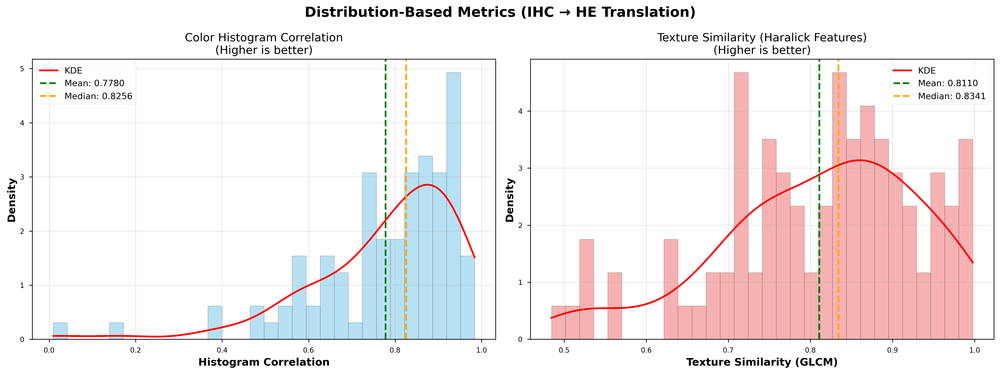
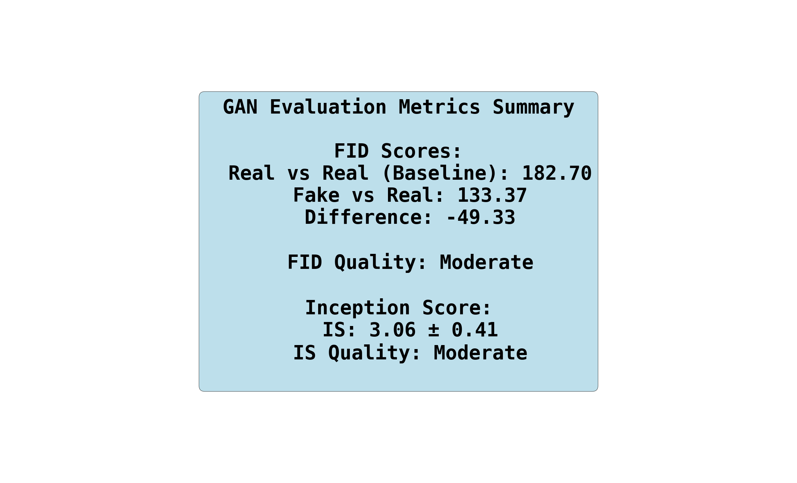
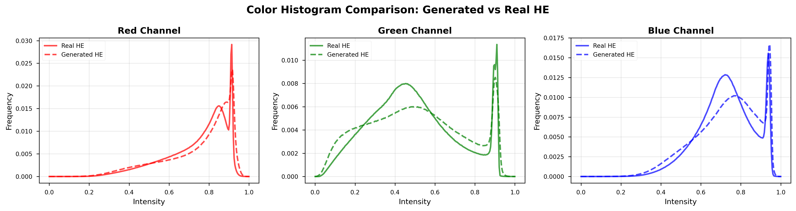

# GA_internal_wsi_virtual_staining

# CycleGAN Virtual Staining Test Report
IHC to H&E Translation Evaluation

## Test Configuration

Model Path: ../../model/HE_IHC_translation/internal_ss/PD-L1/F_99.pth
Test Samples: 100
Image Size: 512×512
Device: cuda:0
Model Epoch: 99

## Important Note

IHC 및 H&E 이미지는 픽셀 정렬이 아닌 연속적인 조직 섹션에서 가져온 것입니다. 따라서 분포 기반 지표만 측정합니다:

✓ FID (Fréchet Inception Distance) - 기본 GAN 메트릭

✓ Inception Score (IS) - 품질 및 다양성 측정

✓ Color Histogram Correlation - 얼룩 색상 분포

✓ Texture Similarity - 조직 구조를 위한 GLCM Haralick 기능

픽셀 단위 메트릭(PSNR, SSIM, MAE, LPIPS)은 이미지 간의 공간적 대응을 필요로 하기 때문에 적용되지 않습니다.

## 간단 Discussion

본 연구의 IHC → H&E virtual staining 결과에서 **Histogram Correlation(0.79)** 및 **Texture Similarity(0.83)**는 비교적 높은 값을 보였다. 이는 생성된 H&E 이미지가 실제 H&E의 전반적인 색 분포와 조직 질감 패턴을 잘 재현함을 시사한다. CycleGAN 기반 변환 과정에서 **조직 구조 보존(structural preservation)**이 안정적으로 이루어졌음을 의미한다.

**Inception Score(2.97)**는 상대적으로 낮은 편이다. 이는 병리 영상 특성상 자연 이미지만큼 IS가 의미 있게 상승하기 어렵고, 클래스 다양성보다 **형태적 일관성**이 강조되는 의료 영상 특성에 기인한다.

FID 측면에서 Fake–Real FID는 **129.56**으로 Baseline 대비 **34.67 감소**하여, virtual staining 이후 실제 H&E 분포에 더 근접했음을 확인했다. 다만 절대적인 FID 값이 여전히 높은 이유는 다음과 같다:

- IHC → H&E는 **cross-modality translation**으로 stain 분포 차이가 매우 크다
- gland, stroma, nuclei 등 **미세 구조의 domain gap**이 존재한다
- IHC 고유의 membrane/marker signal이 완전히 제거되지 않은 residual artifact 존재 가능성이 있다

그럼에도 FID 개선 폭이 뚜렷하다는 점은, 제안된 virtual staining 파이프라인이 단순 색상 변환을 넘어 **조직 수준 분포를 부분적으로 복원**하고 있음을 보여준다.

## Quantitative Results

| **Metric** | **Value** |
| --- | --- |
| Histogram Correlation | 0.7780 ± 0.1710 |
| Texture Similarity | 0.8110 ± 0.1218 |
| Inception Score | 3.06 ± 0.41 |
| FID (Baseline) | 182.70 |
| FID (Fake-Real) | 133.37 |
| FID Difference | −49.33 |

## Interpretation

FID: Moderate (target: <50)
FID Baseline: 182.70 (noise floor)
Inception Score: Moderate (real images: >10)
Color Match: Moderate (target: >0.9)
Texture Match: Good (target: >0.8)

## **Visualize Metric Distributions**

## **Color Histogram Analysis**

## **Qualitative Results**

## **Best and Worst Cases**

